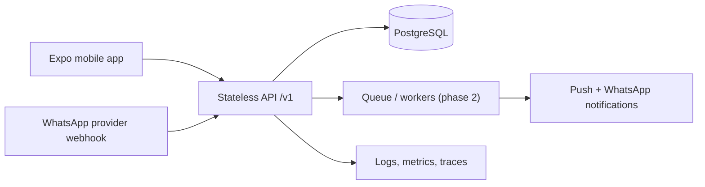

# Regional Scheduler MVP Architecture

## Outcome

One trusted scheduling system serves two entry points: the Expo mobile app and WhatsApp. Both call a stateless API, which owns business rules, authorization, audit history, and writes to PostgreSQL.



The initial implementation is an Express API with Prisma and PostgreSQL. At higher scale, run many API replicas behind a load balancer, move reminders/NLP retries to workers, add Redis for rate-limit and queue coordination, and use read replicas for reporting. The API remains stateless, so this does not require changing the mobile contract.

## Repository structure

```text
regional-scheduler-app/
  backend/
    prisma/schema.prisma             Canonical relational data model
    src/config/env.js                Fail-fast environment validation
    src/routes/                      HTTP boundary and validation
    src/services/                    Audit and WhatsApp language parsing
    src/middleware/                  Authentication
    src/app.js                       Middleware, routes, error boundary
  client/
    app/                             Expo Router screens
    components/                      Reusable UI modules
    lib/api.js                       Typed-by-contract API client boundary
  docs/architecture.md               Product and engineering blueprint
```

## Database model

| Table | Responsibility |
| --- | --- |
| `scheduler_users` | Identity, phone number, password hash, timezone |
| `scheduler_events` | Canonical personal/group schedule with UTC timestamps |
| `scheduler_groups` | Chama metadata and contribution targets |
| `scheduler_group_members` | Membership and owner/admin/member permissions |
| `scheduler_invitations` | Durable RSVP lifecycle; never delete history |
| `scheduler_refresh_tokens` | Hashed, revocable, rotating long-lived sessions |
| `scheduler_otp_challenges` | Expiring, single-use sign-in and reset codes |
| `scheduler_audit_logs` | Traceability for app, API, and WhatsApp actions |

Important constraints are built into Prisma: unique phone numbers, unique group membership, foreign keys, indexes for a user's timeline and a group's timeline, and soft cancellation of events. Timestamps are stored as `DateTime`/UTC; the UI renders them in the user timezone.

## API contract

All API responses either return `{ "data": ... }` or `{ "error": "MACHINE_READABLE_CODE" }`. Authenticated endpoints require `Authorization: Bearer <JWT>`.

| Method | Path | Purpose |
| --- | --- | --- |
| `GET` | `/health` | Load balancer health check |
| `POST` | `/v1/auth/register` | Create a user and session |
| `POST` | `/v1/auth/login` | Create a session |
| `POST` | `/v1/auth/refresh` | Rotate refresh token and issue a new access token |
| `POST` | `/v1/auth/logout` | Revoke one refresh token |
| `POST` | `/v1/auth/logout-all` | Revoke every session for the current user |
| `POST` | `/v1/auth/otp/request` | Send a phone sign-in code |
| `POST` | `/v1/auth/otp/verify` | Verify a phone code and create a session |
| `POST` | `/v1/auth/password-reset/request` | Send a password reset code without account enumeration |
| `POST` | `/v1/auth/password-reset/confirm` | Consume reset code and revoke existing sessions |
| `GET` | `/v1/events?from&to&q` | Read timeline slice/search results |
| `POST` | `/v1/events` | Create an event |
| `PATCH` | `/v1/events/:eventId` | Reschedule or edit an event |
| `DELETE` | `/v1/events/:eventId` | Soft-cancel an event |
| `GET` | `/v1/groups` | User's Chama groups |
| `POST` | `/v1/groups` | Create group and owner membership |
| `GET` | `/v1/groups/feed` | Groups plus pending invitations |
| `POST` | `/v1/groups/:groupId/invitations` | Admin/owner sends an invitation |
| `POST` | `/v1/groups/invitations/:invitationId/rsvp` | Accept or decline invitation |
| `GET` | `/v1/whatsapp/webhook` | Meta webhook verification |
| `POST` | `/v1/whatsapp/webhook` | Normalized inbound WhatsApp message |

For the MVP the WhatsApp webhook accepts a normalized `{ phoneNumber, message, messageId }` body. The provider adapter must validate Meta/Twilio signatures before normalizing the payload. A deterministic parser is included only as a safe development placeholder; production should use structured LLM extraction with a JSON schema, confidence threshold, confirmation flow, idempotency via message ID, and a human-readable clarification when confidence is low.

## Mobile UI architecture

- `app/index.js`: authentication gate, rolling seven-day agenda, create/search/delete interaction.
- `components/CreateEventModal.jsx`: date/time-aware event creation.
- `app/chama.js`: group dashboard and invitation RSVP.
- `lib/api.js`: the only mobile networking boundary; screens never query a database directly.
- `lib/session.js`: stores refresh credentials in Expo SecureStore on iOS/Android, then rotates them into short-lived access tokens at app launch. Browser sessions use `sessionStorage` only.

Never store a service-role key, WhatsApp secret, database URL, or long-lived server credential in the client.

## Production controls

- Secrets only in deployment secret management; use `.env.example` as documentation.
- Passwords use bcrypt; access tokens expire after 15 minutes by default, while opaque refresh tokens are hashed, persisted, rotated, and revocable.
- Phone OTP and password reset codes are hashed, single-use, expire quickly, and allow only five verification attempts. `SMS_PROVIDER=console` is development-only; production requires a configured SMS provider.
- Enforce provider webhook signature verification before accepting WhatsApp messages.
- Apply rate limits at the API edge and at the WhatsApp endpoint independently.
- Use managed PostgreSQL backups, point-in-time recovery, migration CI, and connection pooling (PgBouncer/Supavisor).
- Add Sentry/OpenTelemetry, structured JSON logs, uptime checks, and alerts before launch.
- Add integration tests for authorization, RSVP transactions, and webhook idempotency before accepting real users.
- Deploy the API to Railway using `backend/Dockerfile` and `backend/railway.json`; use separate staging/production Railway services and the matching non-committed environment template.
- Build Android with EAS after creating `client/eas.json`; EAS credentials and production environment variables must live outside Git.

## Delivery sequence

1. Provision managed Postgres and run the initial Prisma migration.
2. Wire real WhatsApp Cloud API signature verification plus outgoing confirmation replies.
3. Configure Africa's Talking (or an equivalent SMS provider) and set production secrets in Railway; do not run with console OTP delivery outside development.
4. Add event edit/reschedule UI and group creation/member-management screens.
5. Add reminder worker, push notifications, conflict detection, monitoring, and automated tests.
